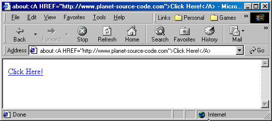



## Embed Webpages into your program \(1 Line of code to implement\!\) \(\(IE Only\)\)

### Description

It allows you to embed HTML documents into your software and create HTML documents on the fly, without needing a connection to the internet..

I think it's limited to IE. Also - I have not hit the upper limit of the about:HTML method.

HOWEVER, you must URL ENCODE the CRLFs and Spaces.

One last thing... You can not edit a page once you put it up using this method, but you could use a BeforeNavigate Sub to capture the URL the person clicked on and set variables that way..
 
### More Info
 

             |
---                |---
**Submitted On**   |
**By**             |[Rabid Nerd Productions](https://github.com/Planet-Source-Code/PSCIndex/blob/master/ByAuthor/rabid-nerd-productions.md)
**Level**          |Beginner
**User Rating**    |3.5 (21 globes from 6 users)
**Compatibility**  |VB 3\.0, VB 4\.0 \(16\-bit\), VB 4\.0 \(32\-bit\), VB 5\.0, VB 6\.0, VB Script, ASP \(Active Server Pages\) 
**Category**       |[Internet/ HTML](https://github.com/Planet-Source-Code/PSCIndex/blob/master/ByCategory/internet-html__1-34.md)
**World**          |[Visual Basic](https://github.com/Planet-Source-Code/PSCIndex/blob/master/ByWorld/visual-basic.md)
**Archive File**   |

### Source Code

<h2>Embedding HTML into VB</h2> 
...and ANY URL without SCRIPT!

<small><A HREF="mailto:webmaster@hlrcomputers.com>by Herb Riede</A></small>

You need either a WebBrowser control to use the Navigate/Navigate2 URL method, or use a shell execute method similar to the one at:  <A HREF="http://www.planet-source-code.com/vb/scripts/ShowCode.asp?lngWId=1&txtCodeId=1320">PSC Code 1320</A> 
Just replace the URL with the "about:HTML Code" or a string holding it like so:

HTMLString = "about:<A HREF=http://www.planet-source-code.com>Planet Source Code</A>" 
Form1.WebBrowser1.Navigate HTMLString

-or-

Run a ShellExecute like the one at the code linked to above like this:

HTMLString = "about:<A HREF=http://www.planet-source-code.com>Planet Source Code</A>" 
WebURL (HTMLString)

The first one launches the page in your WebBrowser control in your app, the second launches the default browser (though this only
works in IE I think) with the code.

<H3>Just For Your Enjoyment:</H3> 
There are hidden 'easter-egg' about codes in IE including: 
<A HREF="about:mozilla">about:mozilla</A>

Oops.. the next one messed up PSC's page at first: 
about:<!-- introducing the Trident team -->

